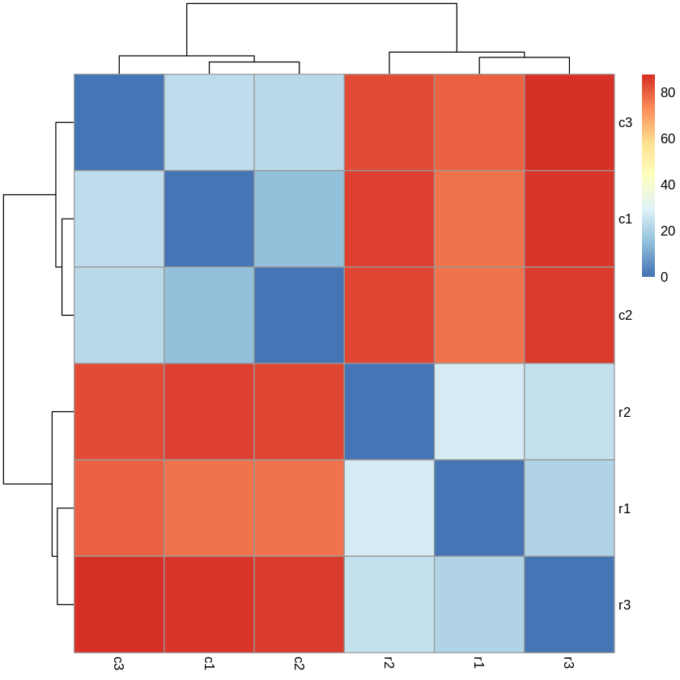
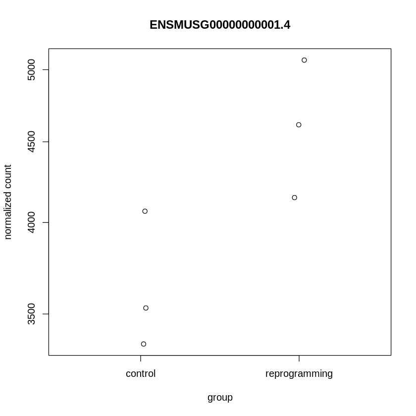

# Домашнее задание №3
###### Поморцев Леонид 2 группа

## Задание №1
Ссылка на Google Сolab: https://colab.research.google.com/drive/1K-IA2jcXAyNSq15rMeFvYHQl3CUGZXmR

### Отчёт multiQC
Ссылка: https://github.com/harspect/hse21_hw3/blob/3cf84bab4d05cd5f7e2adff84e717558adb01745/multiqc_report.html

### Таблица
Sample ID | тип | __no_feature | __ambiguous | уникально-картированные | общее кол-во |
 --- |--- |--- |--- |--- | ---
SRR3414629 | reprogramming | 1604107 | 722172 | 18375888 | 16049609 |
SRR3414630 | reprogramming | 1240295 | 480520 | 13186139 | 11465324 |
SRR3414631 | reprogramming | 1700354 | 819740 | 20928945 | 18408851 |
SRR3414635 | control | 1392186 | 760134 | 18428317 | 16275997 |
SRR3414636 | control | 1332692 | 735108 | 17825380 | 15757580 |
SRR3414637 | control | 1397650 | 710230 | 17844858 | 15736978 |

## Задание №2
Ссылка на Google colab на R: https://colab.research.google.com/drive/1vO2jcpgGv1cWoLopudMZF_QcAleG2AAu

### MA-plot

### Тепловая карта

### Графики со значениями "Normalized counts" в контрольных и перепрограммированных образцах

